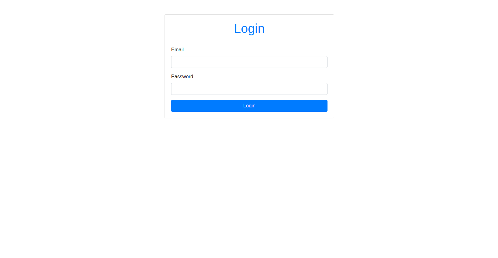
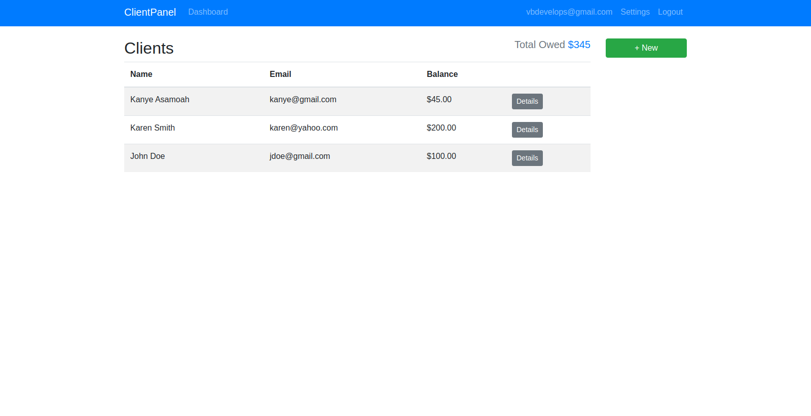
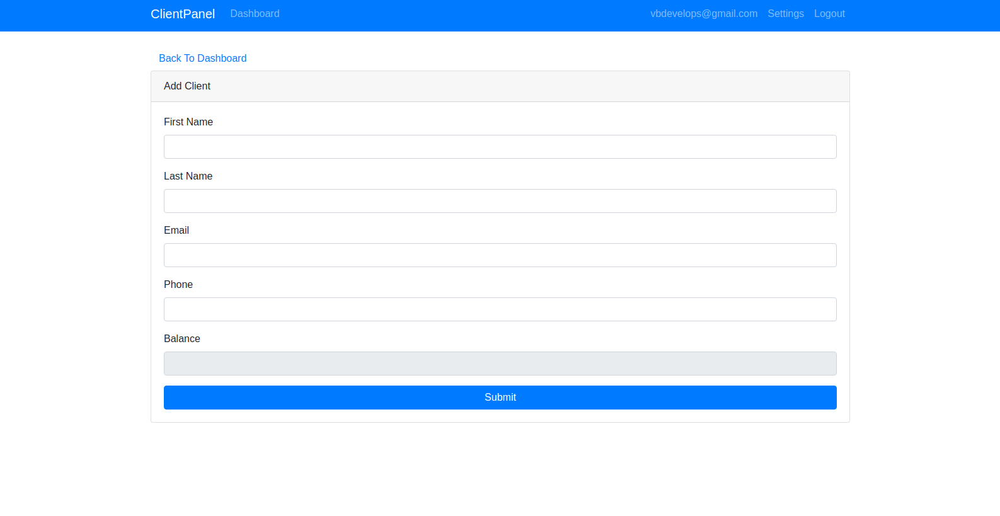
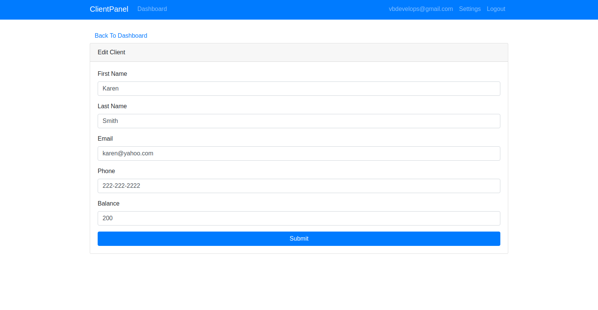
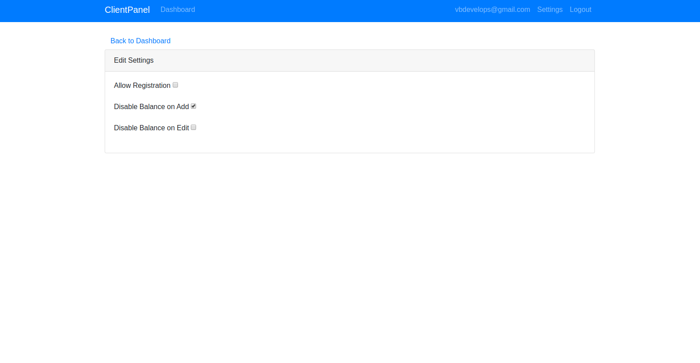

# Client-Panel Dashboard

## Live Demo

The live demo version of the application can be accessed at [https://clientpanel-cf0e1.firebaseapp.com/](https://clientpanel-cf0e1.firebaseapp.com/)

## Table Of Content

- [About the app](#about-the-app)
- [Technologies](#technologies)
- [Setup](#setup)
- [Approach](#approach)
- [Status](#status)
- [Learn more](#learn-more)

## About The App
A dashboard application with full **CRUD** functionalities and **authentication** (a full-stack web application) built with **React**, **Firebase**, and **Twitter Bootstrap**. The app allows an authenticated user to performa a create, read, update, and delete operations on a client. Also, there is a `settings page` that allows the authenticated user to perform certain actions such as enabling or disabling a register form and balance input field.


## Technologies

- React (create-react-app)
- Typescript
- Redux
- Bootstrap

## Setup

To run this project, install it locally using npm:

```
$ cd ../client-panel
$ npm install
$ npm run start.dev // run in dev mode
$ npm start // run a production-build version 
```

## Approach

- Solution implemented with create-react-app (typescript version)
- Style guide adopted is BEM
- Typechecking is done using typescript
- Handled state using Redux
- Backend solution used is firebase (`firestore, hosting`)
- Folders within the `src` folder:
  - `Assets`: holds all static images
  - `Components`: holds resuable components
  - `Container`: holds are stateful components and served as pages.
  - `Layout`: holds the structure of a page
  - `Stylesheet:` This folder holds the 7-in-1 structure for implementing sass and scss

## Screenshots







## Inspiration

This app is based on Traversy React Redux course.